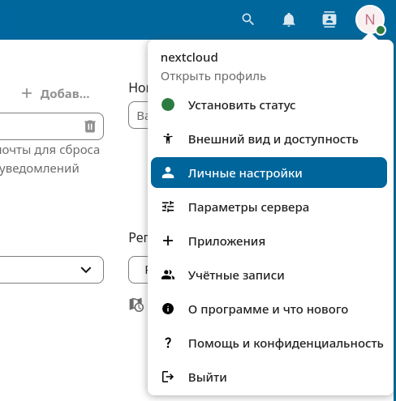
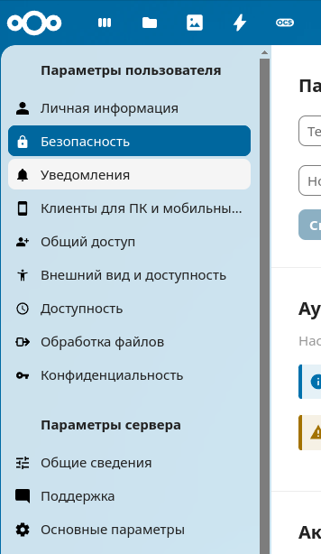
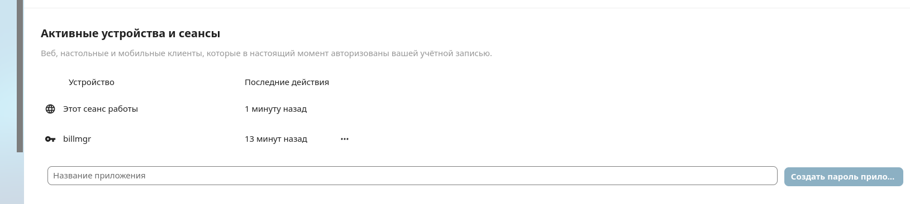
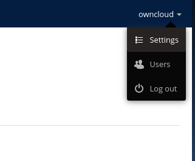
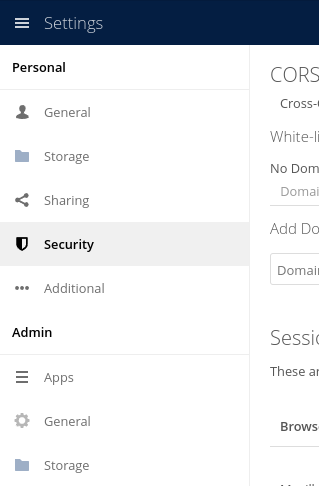
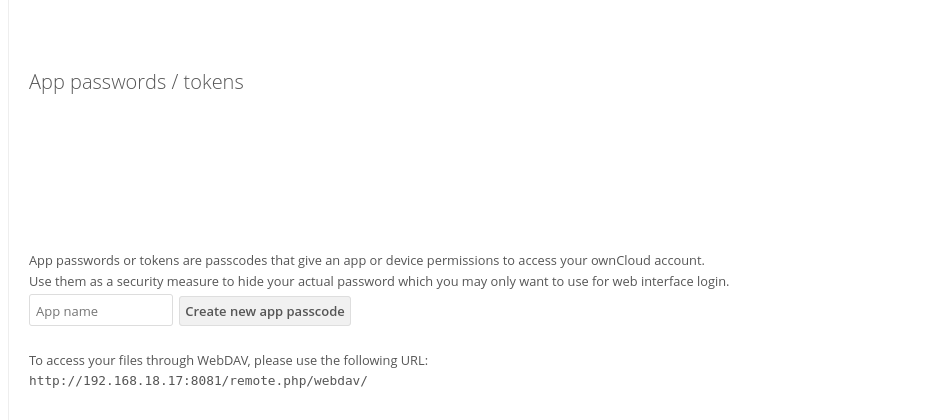

# Предначначение моудля
Модуль предначначен для интеграции возможности приобретения дискового пространства в NextCloud/ownCloud

# Установка
1. Нужно установить панель NextCloud/ownCloud (в репозитории есть docker-compose файл в котором собраны изображения для запуска обеих панелей). Для избежания конфликтов стоит запускать панели NextCloud/ownCloud в конейнерах или устанавлиать их на отдельных серверах

2. Для установки обработчика нужно клонировать данный репозиторий    
``` git clone https://github.com/LC208/bill-nextcloud.git ```

3. В корневой папке склонированного репозитория выполнить команду   
```make all```

4. Сгенериррровать пароль приложения
    - NextCloud
    
    
    
    
    
    - ownCloud
    
    
    
    

5. Регистрация обработчика и добавление тарифов в billmanager

# Создание обработчика
При создании модуля необходимо указать логин и пароль приложения от аккаунта из группы admin и базовую ссылку на панель
Базовая ссылка - это адрес, по которому доступна панель

# Используемые содержания
- disk disc - объём дискового пространства

# Используемые параметры
- userpassword - пароль пользователя в панели
- username - имя пользователя в панели
- url - ссылка на панель

# Первоначальная настройка
При выполнении смены тарифа, аккаунт не переносится на другую панель, так что удостоверьтесь, что на всех панелях группы одинаковы, либо запретите смену тарифов для разных обработчиков.

# Сбор статистики
Сбор статистики выполняется по 3-ём возможным наименованиям: 
- disk disc
- disk
- disc

За сбор статистики отвечает задание планировщика cron — statdaily.cron.

Статистика за ту же дату суммируется

# Поддерживаемые типы продуктов
- backupservice